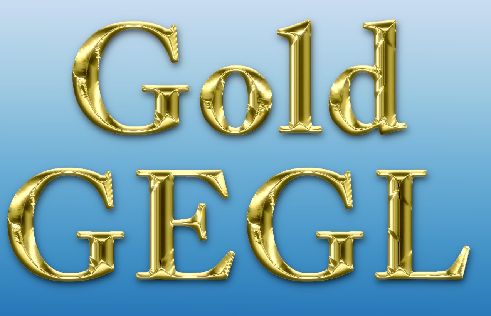
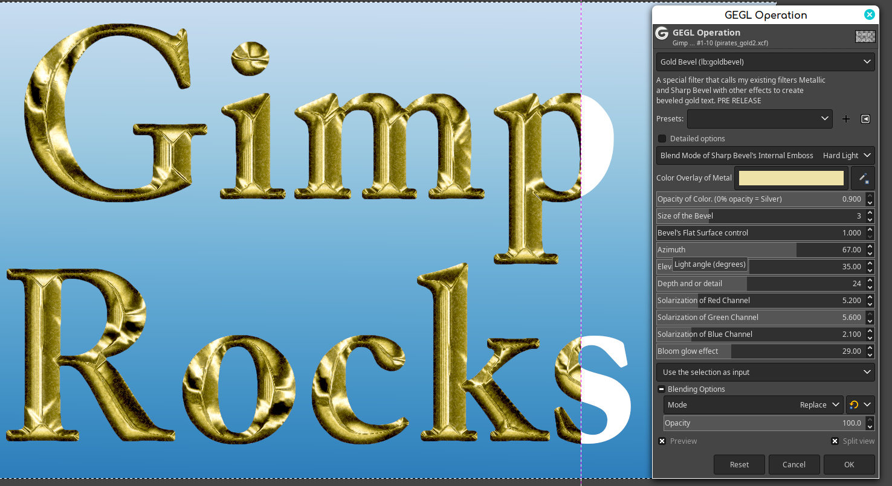
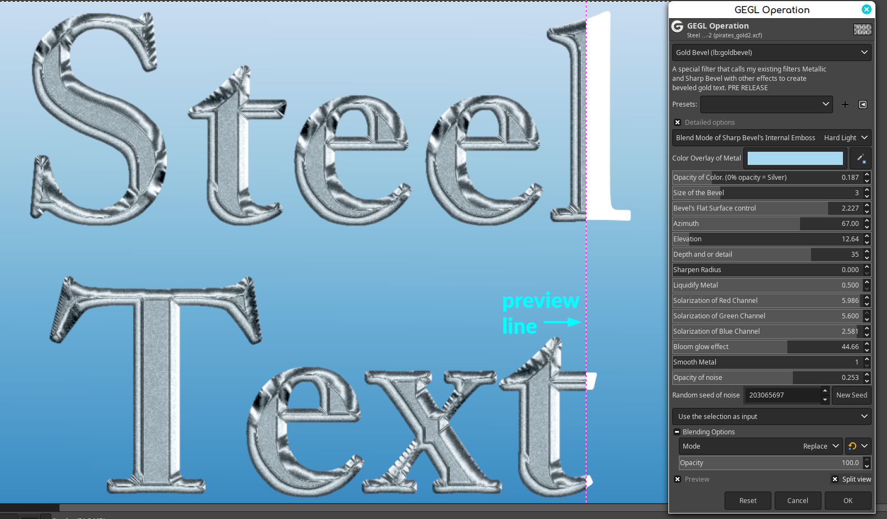
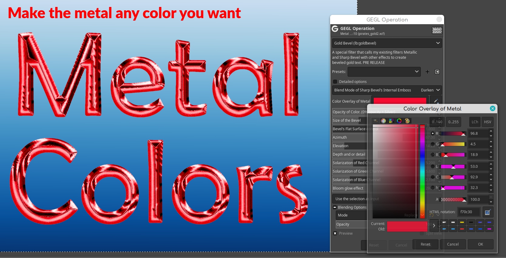

For binary downloads please go to the "releases" section

https://github.com/LinuxBeaver/Gimp_Gold_Bevel_Text_Style_Plugin/releases

## Gold Bevel Text Style plugin for Gimp

A Gimp Plugin that transforms plain text into a gold bevel metal text. It also has two dependencies that
are full fledge filters of their own "metallic" and "sharp bevel". If you already have any of these binaries
from downloading my plugins from before, overwrite all of them with the latest version.





## Location to put Binaries 
They don't go in the normal plugins directory.

### Windows
 C:\Users\(USERNAME)\AppData\Local\gegl-0.4\plug-ins
 
### Linux 
 /home/(USERNAME)/.local/share/gegl-0.4/plug-ins
 
### Linux (Flatpak includes Chromebook)
 /home/(USERNAME)/.var/app/org.gimp.GIMP/data/gegl-0.4/plug-ins

## This plugin has bonus built in presets that are NOT needed for it to work. 
If you them them put the text file "GimpGegl-lb-goldbevel-config.settings" in

## Windows (GimpGegl-lb-goldbevel-config.settings)
C:\Users\username\AppData\Roaming\GIMP\2.10\filters

### Linux (GimpGegl-lb-goldbevel-config.settings)
/home/USERNAME/.config/GIMP/2.10/plug-ins

###Flatpak (GimpGegl-lb-goldbevel-config.settings)
/home/USERNAME/.var/app/org.gimp.GIMP/config/GIMP/2.10/filters

This will give you three really cool presets that make gold without noise/grain and steel text.

## Compiling and Installing

### Linux

Clicking build_everything will compile everything if you are on Linux or Windows with MySys2. 
Below are directions.

To compile and install you will need the GEGL header files (`libgegl-dev` on
Debian based distributions or `gegl` on Arch Linux) and meson (`meson` on
most distributions).

```bash
meson setup --buildtype=release build
ninja -C build

```

If you have an older version of gegl you may need to copy to `~/.local/share/gegl-0.3/plug-ins`
instead (on Ubuntu 18.04 for example).

BEAVER RECOMMENDS YOU USE A MODERN VERSION OF GEGL. NO GUARANTEE DATED VERSIONS OF GIMP WILL WORK WITH THIS PLUGIN (USE GIMP 2.10.32+)

### Windows

The easiest way to compile this project on Windows is by using msys2.  Download
and install it from here: https://www.msys2.org/

Open a msys2 terminal with `C:\msys64\mingw64.exe`.  Run the following to
install required build dependencies:

```bash
pacman --noconfirm -S base-devel mingw-w64-x86_64-toolchain mingw-w64-x86_64-meson mingw-w64-x86_64-gegl
```

Then build the same way you would on Linux:

```bash
meson setup --buildtype=release build
ninja -C build
```

## After installing Plugin

Restart Gimp and go to GEGL Operations Drop Down List and look for "Gold Bevel". 
If you use Gimp 2.99.16+ go to filters>Text Styling or just search for it.

Alt Preview of Steel Text preset



Alt Color Preview on Darken Blend Mode




